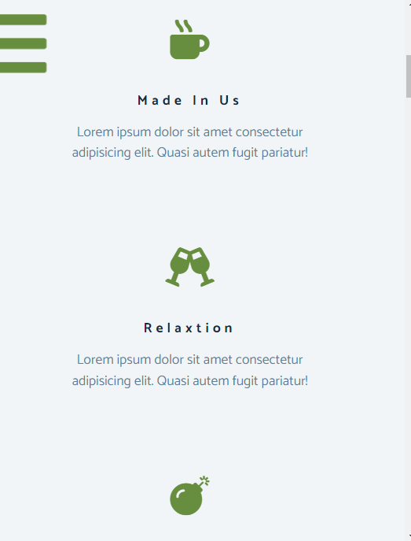

# Frontend Practice - Tea Station Project

This is a Practice Project

## Table of contents

- [Overview](#overview)
  - [The challenge](#the-challenge)
  - [Screenshot](#screenshot)
  - [Links](#links)
- [My process](#my-process)
  - [Built with](#built-with)
- [Author](#author)

## Overview

### The challenge

Users should be able to:

- View the optimal layout for the site depending on their device's screen size
- See hover states for all interactive elements on the page

### Screenshot

- Desktop: 
- Desktop: 
- Desktop: 

- Mobile: 
- Mobile: 
- Mobile: 

### Links

- Solution URL: [https://github.com/AkashSoren1234/SunnySide_WebPage](https://github.com/AkashSoren1234/SunnySide_WebPage)
- Live Site URL: [https://akashsoren1234.github.io/SunnySide_WebPage/](https://akashsoren1234.github.io/SunnySide_WebPage/)

## My process

### Built with

- Semantic HTML5 markup
- CSS custom properties
- Flexbox
- Mobile-first workflow

## Author

- Frontend Mentor - [@AkashSoren1234](https://www.frontendmentor.io/profile/AkashSoren1234)

